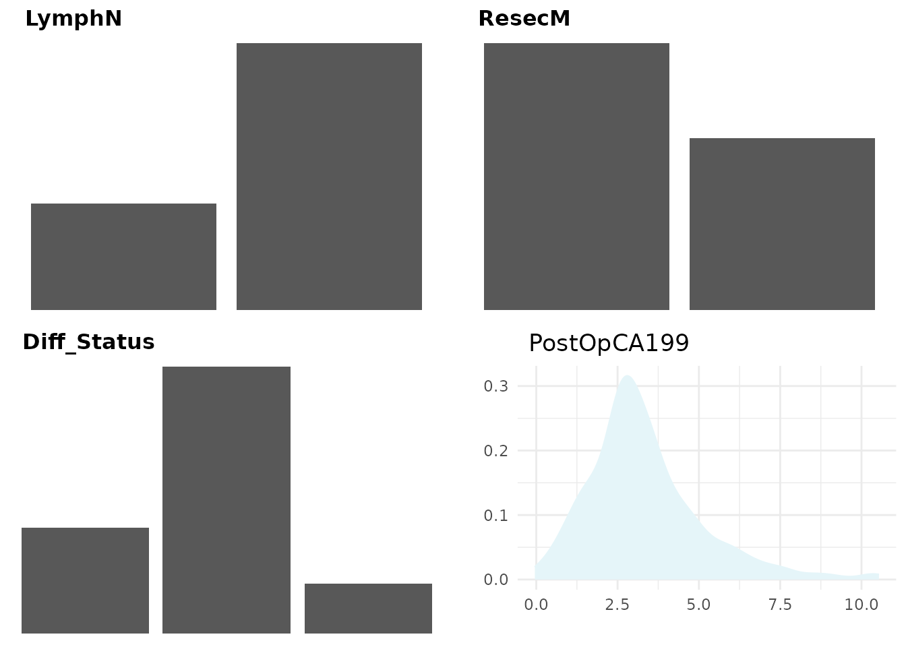
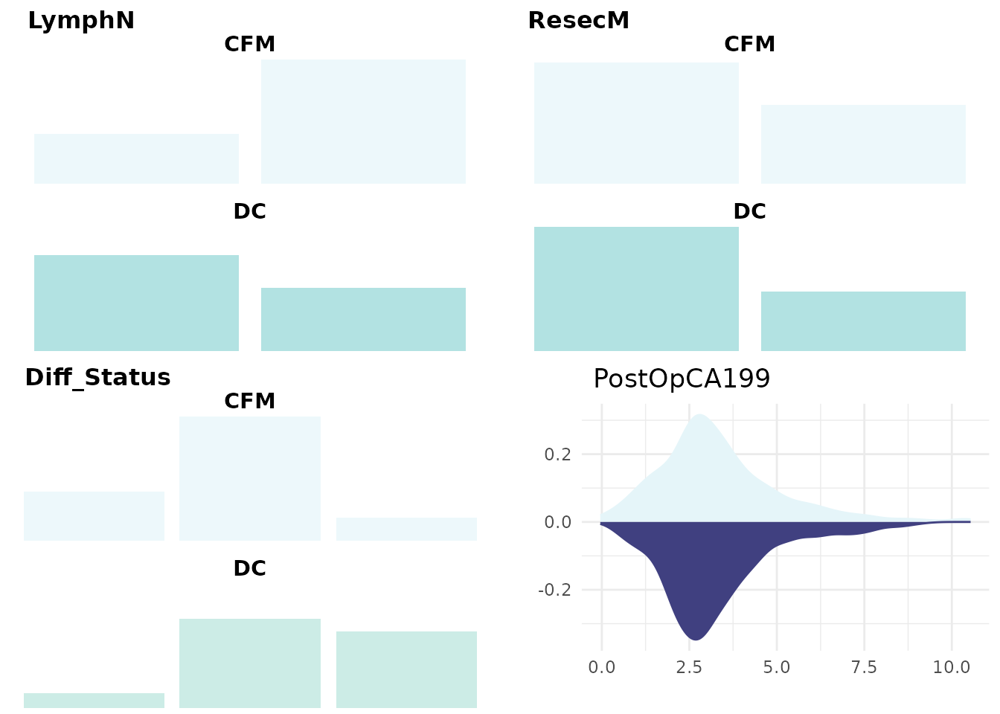
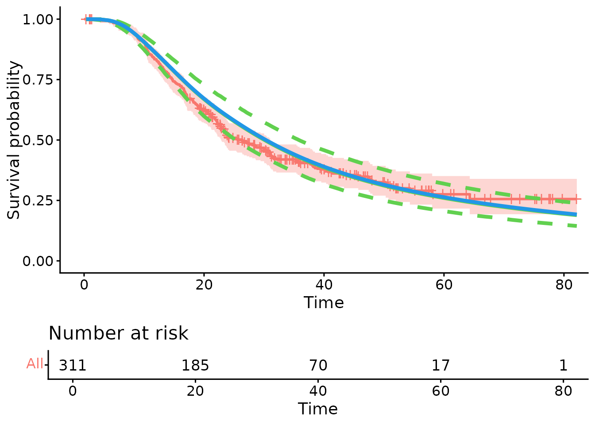

# psc-vignette

## Introduction

The psc.R package implements the methods for applying Personalised
Synthetic Controls, which allows for patients receiving some
experimental treatment to be compared against a model which predicts
their reponse to some control. This is a form of causal inference which
differes from other approaches in that

Data are only required on a single treatment - all counterfactual
evidence is supplied by a parametric model

Causal inference, in theory at least, is estimated at a patient level -
as opposed to estimating average effects over a population

The causal estimand obtained is the Average Treatment Effect of the
Treated (ATT) which differs from the Average Treatment Effect (ATE)
obtained in other settings and addresses the question of whether
treatments are effective in the population of patients who are treated.
This estimand then targets efficacy over effectivness.

In its basic form, this method creates a likelihood to compare a cohort
of data to a parametric model. See (X) for disucssion on it’s use as a
causal inference tool. To use this package, two basic peices of
information are required, a dataset and a model against which they can
be compared.

In this vignette, we will detail how the psc.r package is constructed
and give some examples for it’s application in practice.

## Methodology

The `pscfit` function compares a dataset (‘DC’) against a parametric
model. This is done by selecting a likelihood which is identified by the
type of CFM that is supplied. At present, two types of model are
supported, a flexible parmaeteric survival model of type ‘flexsurvreg’
and a geleneralised linear model of type ‘glm’.

Where the CFM is of type ‘flexsurvreg’ the likeihood supplied is of the
form:

$$L\left( D \mid \Lambda,\Gamma_{i} \right) = \prod\limits_{i = 1}^{n}f\left( t_{i} \mid \Lambda,\Gamma_{i} \right)^{c_{i}}S\left( t_{i} \mid \Gamma,\Lambda_{i} \right)^{(1 - c_{i})}$$

Where $\Gamma$ defines the cumulative baseline hazard function,
$\Lambda$ is the linear predictor and $t$ and $c$ are the event time and
indicator variables.

Where the CFM is of the type ‘glm’ the likelihood supplied is of the
form:

$$L\left( x \mid \Gamma_{i} \right) = \prod\limits_{i = 1}^{n}b\left( x \mid \Gamma_{i} \right)\exp\{\Gamma_{i}t(x) - c\left( \Gamma_{i} \right)\}$$

Where $b(.)$, $t(.)$ and $c(.)$ represent the functions of the
exponential family. In both cases, $\Gamma$ is defiend as:

$$\Gamma_{i} = \gamma x_{i} + \beta$$

Where $\gamma$ are the model coefficients supplied by the CFM and
$\beta$ is the parameter set to measure the difference between the CFM
and the DC.

Estimation is performed using a Bayesian MCMC procedure. Prior
distributions for $\Gamma$ (& $\Lambda$) are derived directly from the
model coefficients (mean and variance covariance matrix) or the CFM. A
bespoke MCMC routine is performed to estimate $\beta$. Please see
‘?mcmc’ for more detials.

For the standard example where the DC contains information from only a
single treatment, trt need not be specified. Where comparisons between
the CFM and multiple treatments are require, a covariate of treamtne
allocations must be specified sperately (using the ‘trt’ option).

## Package Structure

The main function for using applying Personal Synthetic Controls is the
pscfit() function which has two inputs, a Counter-Factual Model (CFM)
and a data cohort (DC). Further arguments include

- nsim which sets the number of MCMC iterations (defaults to 5000)
- ‘id’ if the user wishes to restrict estimation to a sub-set (or
  individual) within the DC
- ‘trt’ to be used as an initial identifier if mulitple treatment
  comparisons are to be made (please see the Mulitple Treatment
  Comparison below)

### psc object

The output of the “pscfit()” function is an object of class ‘psc’. This
class contains the following attributes

- A definition of the calss of the model supplied
- A ‘cleaned’ dataset including extracted components of the CFM and the
  cleaned DC included in the procedure
- An object defingin the class of model (and therefore the procedure
  applied - see above)
- A matrix containing the draws of the posterior distributions

### Postestimation functions

basic post estimation functions have been developed to work with the psc
object, namely “print()”, “coef()”, “summary()” and “plot()”. For the
first three of these these provided basic summaries of the efficacy
parameter obtained from the posterior distribution.

## Motivating Example

The psc.r package includes as example a dataset “e4_data” which is
derived from patients ith pancreatic ductal adenocarcinoma (PDAC) who
have all received some experimental treatment, in this case GemCap.
Aside from this we also provide a Counter Factual Model (CFM) for
patients in the same setting (named ‘gemCFM’) to receive a therapy
called ‘Gem’. The aim here is to produce a ‘GemCap Vs Gem’ comparison.
We start by loading the package and from there obtianing the data and
the model for analysis.

``` r
#remove.packages("psc")
#rm(list=ls())
library(devtools)
#> Loading required package: usethis
install_github("richjjackson/psc")
#> Using github PAT from envvar GITHUB_PAT. Use `gitcreds::gitcreds_set()` and unset GITHUB_PAT in .Renviron (or elsewhere) if you want to use the more secure git credential store instead.
#> Downloading GitHub repo richjjackson/psc@HEAD
#> digest (0.6.37 -> 0.6.38) [CRAN]
#> Installing 1 packages: digest
#> Installing package into '/home/runner/work/_temp/Library'
#> (as 'lib' is unspecified)
#> ── R CMD build ─────────────────────────────────────────────────────────────────
#> * checking for file ‘/tmp/Rtmpy1LMIl/remotes20c571f9c0c6/richJJackson-psc-4cf38c4/DESCRIPTION’ ... OK
#> * preparing ‘psc’:
#> * checking DESCRIPTION meta-information ... OK
#> * checking for LF line-endings in source and make files and shell scripts
#> * checking for empty or unneeded directories
#> * building ‘psc_2.0.0.tar.gz’
#> Installing package into '/home/runner/work/_temp/Library'
#> (as 'lib' is unspecified)
library(psc)
#> Loading required package: survival
#> Loading required package: ggplot2
e4_data <- psc::e4_data
gemCFM <- psc::gemCFM
```

\#`{r} #library(parallel) #library(posterior) #library(ggplot2) #library(survminer) #library(ggpubr) #library(survival) #`

Starting with the model, we can inspect the model terms included in the
counter factual model using

``` r
gemCFM$terms
#> [1] "LymphN"      "ResecM"      "Diff_Status" "PostOpCA199" "(weights)"
```

Included is a list of prognostic covariates:

- Lymph Nodes: patient lymph node status; negative (n=1) or positive
  (n=2) lymph nodes
- Diff_Status: tumour grade; 1,2 or 3
- PostOpCA199: log transformed ca19.9

Similarly we can observe the outcome terms. As the gemCFM object is a
survival model this includes terms named “time” and “cen”. NB the pscfit
function will search for these terms and so it is important that
outcomes included in the data cohort (DC) are labelled in the same way.

``` r
gemCFM$out.nm
#> [1] "time" "cen"
```

Importantly the covariates included in the DC must have names which
match these.  
Prior to comparing the DC to the CFM then it is advisable to get an good
understanding of the data included in the CFM. Within the CFM object
there are a series of plots to visualise the covariate values which can
be extracted using the ‘plotCFM’ function

``` r
plotCFM(gemCFM)
```



We give esamples of how the ‘pscfit()’ function can be used to comapre
data against models with survival outcomes (with a ‘flexsurvreg’ model).
Examples on how to perform analyses using GLM model objects are
available from the github repo <https://github.com/richJJackson/psc>

### Survival Example

For an example with a survival outcome a model must be supplied which is
contructed ont he basis of flexible parametric splines. This is
contructed using the “flexsurvreg” function within the “flexsurv”
package. An example is included within the ‘psc.r’ package names
‘surv.mod’ and is loaded using the ’data()” function:

The ‘gemCFM’ is an object of class pscCFM which means it contains all of
the structures required for analysis but has stripped the model object
of any patient level data. Please note that the psc package can be used
by providing standard ‘glm’ or ‘flexsurvreg’ models. Here the procedures
will convert the model into a ‘pscCFM’ object using the pscCFM()
function.

In this example the ‘gemCFM’ model is constructed with 5 internal knots
and hence 7 parameters to describe the baseline cumulative hazard
function:

``` r
gemCFM$haz_co
#>      gamma0      gamma1      gamma2      gamma3      gamma4      gamma5 
#> -11.3808020   3.8359818   1.2911623  -1.3176560   1.1190182  -0.8876277 
#>      gamma6 
#>   0.3372484
```

There are also prognostic covariates which match with the prognostic
covariates in the data cohort….

``` r
gemCFM$cov_co
#>      LymphN1      ResecM1 Diff_Status1 Diff_Status2  PostOpCA199 
#>    0.4876152    0.1805322   -0.4160534   -0.5897823    0.2671471
```

The process of comparing the DC to the CFM occures across 4 steps:

- Step 1: Combine/Compare the DC and the CFM using the pscData()
  function
- Step 2: Obtain initial values for the estimation procedue using init()
- Step 3: Run the MCMC estimation procedure
- Step 4: Collate and summarise the results

Each of these steps update a ‘pscOb’ object resutls which is returned to
the user. This process is wrapped up in a single ‘pscfit()’ function/

NB. A warning is supplied here just to note that data have been removed
form the DC prior to analysis due to missing data.

We can view the attributes of the psc object that is created. This
includes details on all components including the CFM, the DC, the
likelihood applied, the starting values and posterior distribuion

``` r
attributes(surv.psc)
#> $names
#>  [1] "mod_class" "terms"     "out.nm"    "cov_class" "cov_lev"   "co"       
#>  [7] "cov_co"    "sig"       "haz_co"    "k"         "kn"        "lam"      
#> [13] "formula"   "datasumm"  "datavis"   "DC"        "lik"       "start.mu" 
#> [19] "start.sd"  "cfmPost"   "target"    "betaPrior" "ncores"    "draws"    
#> [25] "postFit"   "postEst"  
#> 
#> $class
#> [1] "psc"
```

Its worth noting that as part of the ‘pscData()’ function which ensures
the DC and CFM are compatible - the ‘datavis’ object has been updated.
This will now produce a useful figure to allow evaulation of how
comparable the data from the CFM and DC are using the ‘plotCFM()’
function

``` r
plotCFM(surv.psc)
```



We make use of the ‘posterior’ package to summarise the posterior
distributions (saved within the ‘draws’ object). Both ‘print()’ and
‘coef()’ will show these although the ‘summary()’ function provides mode
information:

This includes information on the underlying CFM as well as expected
meand response for patients in the DC along with 95% CI (obtianed using
bootstrapping). A summary of the MCMC fit is supplied along with the
overall summary of the posterior distribution.

``` r
summary(surv.psc)
#> Counterfactual Model (CFM): 
#> A model of class 'flexsurvreg' 
#>  Fit with 5 internal knots
#> 
#> CFM Formula: 
#> Surv(time, cen) ~ LymphN + ResecM + Diff_Status + PostOpCA199
#> <environment: 0x564404c59b00>
#> 
#> CFM Summary: 
#> Expected response for the outcome under the CFM:
#>     S     lo     hi  
#> 30.30  25.51  35.79  
#> 
#> Observed outcome from the Data Cohort:
#>          [,1] 
#> median   26.33
#> 0.95LCL  22.85
#> 0.95UCL  31.03
#> 
#> MCMC Fit: 
#> Posterior Distribution obtaine with fit summary:
#>       variable     rhat         ess_bulk     ess_tail     mcse_mean  
#> [1,]  beta_1       1.000952     1825.11      2153.515     0.002000087
#> 
#> Summary: 
#> Posterior Distribution for beta:Call:
#>  CFM model + beta
#> 
#> Coefficients:
#>            variable      mean          sd            median        q5          
#> posterior  beta_1        -0.009312022  0.0864278     -0.00746047   -0.1542111  
#>            q95         
#> posterior  0.1299042
```

Lastly to visualise the original model and the fit of the data, the plot
function has been included

``` r
plot(surv.psc)
#>            variable      mean          sd            median        q5          
#> posterior  beta_1        -0.009312022  0.0864278     -0.00746047   -0.1542111  
#>            q95         
#> posterior  0.1299042
#> Warning: Using `size` aesthetic for lines was deprecated in ggplot2 3.4.0.
#> ℹ Please use `linewidth` instead.
#> ℹ The deprecated feature was likely used in the ggpubr package.
#>   Please report the issue at <https://github.com/kassambara/ggpubr/issues>.
#> This warning is displayed once every 8 hours.
#> Call `lifecycle::last_lifecycle_warnings()` to see where this warning was
#> generated.
#> Ignoring unknown labels:
#> • colour : "Strata"
```


