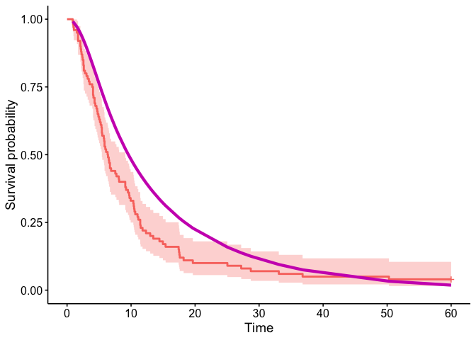

# psc

The goal of psc is to compare a dataset of observations against a
parametric model

## Installation

You can install the development version of psc from
[GitHub](https://github.com/) with:

``` r
# install.packages("devtools")
devtools::install_github("richJJackson/psc")
```

## Example

This is a basic example which shows you how to solve a common problem:

``` r
library(psc)
#> Warning: replacing previous import 'posterior::var' by 'stats::var' when
#> loading 'psc'
#> Warning: replacing previous import 'posterior::sd' by 'stats::sd' when loading
#> 'psc'
#> Warning: replacing previous import 'posterior::mad' by 'stats::mad' when
#> loading 'psc'
library(survival)
## basic example code

### Load model
data("surv.mod")

### Load Data
data("data")
#> Warning in data("data"): data set 'data' not found

### Use 'pscfit' to compare
surv.psc <- pscfit(surv.mod,data)
#> Warning in pscData_match(CFM$cov_class, CFM$cov_lev, DCcov): vi specified as a character in the model, consider respecifying
#>                 as a factor to ensure categories match between CFM and DC
#> Warning in pscData_match(CFM$cov_class, CFM$cov_lev, DCcov): allmets specified as a character in the model, consider respecifying
#>                 as a factor to ensure categories match between CFM and DC
```

You can use standard commands for getting a summary of your analysis…

``` r
summary(surv.psc)
#> Counterfactual Model (CFM): 
#> A model of class 'flexsurvreg' 
#>  Fit with 3 internal knots
#> 
#> CFM Formula: 
#> Surv(time, cen) ~ vi/age60 + ecog + allmets + logafp + alb + 
#>     logcreat + logast + aet
#> <environment: 0x11b23ef28>
#> 
#> CFM Summary: 
#> Expected response for the outcome under the CFM:
#>      S      lo      hi  
#>  9.694   9.094  10.653  
#> 
#> Observed outcome from the Data Cohort:
#>          [,1] 
#> median   6.366
#> 0.95LCL  5.436
#> 0.95UCL  9.094
#> 
#> MCMC Fit: 
#> Posterior Distribution obtaine with fit summary:
#>       variable    rhat        ess_bulk    ess_tail    mcse_mean 
#> [1,]  beta_1      1.000707    4222.245    3977.807    0.00151382
#> 
#> Summary: 
#> Posterior Distribution for beta:Call:
#>  CFM model + beta
#> 
#> Coefficients:
#>            variable    mean        sd          median      q5        
#> posterior  beta_1      0.395547    0.09849599  0.3994494   0.229423  
#>            q95       
#> posterior  0.5514348
```

… and to see a plot of what you have done

``` R
#>            variable    mean        sd          median      q5        
#> posterior  beta_1      0.395547    0.09849599  0.3994494   0.229423  
#>            q95       
#> posterior  0.5514348
#> Warning: Using `size` aesthetic for lines was deprecated in ggplot2 3.4.0.
#> ℹ Please use `linewidth` instead.
#> ℹ The deprecated feature was likely used in the ggpubr package.
#>   Please report the issue at <https://github.com/kassambara/ggpubr/issues>.
#> This warning is displayed once every 8 hours.
#> Call `lifecycle::last_lifecycle_warnings()` to see where this warning was
#> generated.
#> Ignoring unknown labels:
#> • colour : "Strata"
```



In that case, don’t forget to commit and push the resulting figure
files, so they display on GitHub and CRAN.
